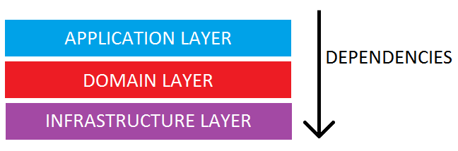

# Tormentum API
[](https://circleci.com/gh/TheTwoCoders/tormentum-api/tree/main)

This is the API for Tormentum app.

## API Architecture



The API has a 3 layer architecture:

- Application Layer: Has the files that controls the application. Routes, Controllers and I/O objects come here.
- Domain Layer: Where are all the business rules. Here are the Use Cases, Entities and Repositories.
- Infra Layer: Connection with external services. Database, External APIs and Server configs come here.

## How to Run?

### Installing Packages

Before running any command you need to install packages using: 

```bash
$ yarn install
```

### Initial Setup

To set environment variables and to be able to run the project, you must run first:

```bash
$ yarn setup
```

This will run `scripts/setup.sh` script and set `.env` file.

### Running Tests

Tests use MongoDB memory server. So, it's simple to run, you just need:

```bash
$ yarn test
```

### Running API Locally

To run the API locally, you have first to start MongoDB through Docker:

```bash
$ docker compose up -d mongo
```

Then, you can start the app:

```bash
$ yarn start
```
